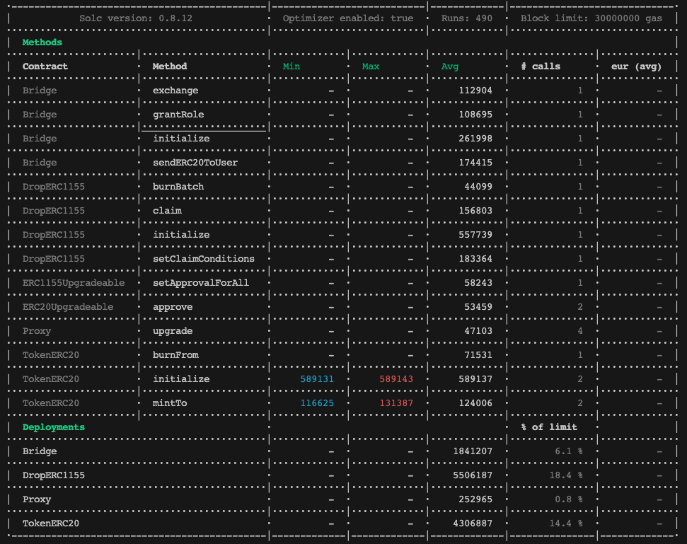

# Miracle Bridge

Try running some of the following tasks:

```shell
npm install
npm install --global hardhat-shorthand

hh test
```

## gas report



## sequence diagram


## contract 
proxy admin https://polygonscan.com/address/0x1fe9a069b4a7135fa07d6353c12cc33a7e092c09
fee https://polygonscan.com/address/0x82fcb7bdaa578da16d10074e07784ba318be702c

proxy https://polygonscan.com/address/0xD57A69F8c3Ab0c4f15C0b331877134E61E20a147
real https://polygonscan.com/address/0x625d3fd726cc86f1463b50376dec62359d61a1f0

proxy https://basescan.org/address/0xae5ff29139e0a0dcd0dcf4738d44694327c6325f
real https://basescan.org/address/0x8d14e9a4690e71cad1fe3c74e68b58cd4c352398

proxy https://avascan.info/blockchain/c/address/0x215E1Bf3dd7ef0A5d5A740E965A3e090ca3B91E4/contract
real https://avascan.info/blockchain/c/address/0xa28A5B88048aCE5c5699a38B5d2b6B82eb729D04/contract


## flatten
npx hardhat flatten ./contracts/bridge/Bridge.sol > ./flatten/Bridge.sol

npx hardhat flatten ./contracts/multisig/TimelockMultiSig.sol > ./flatten/TimelockMultiSig.sol