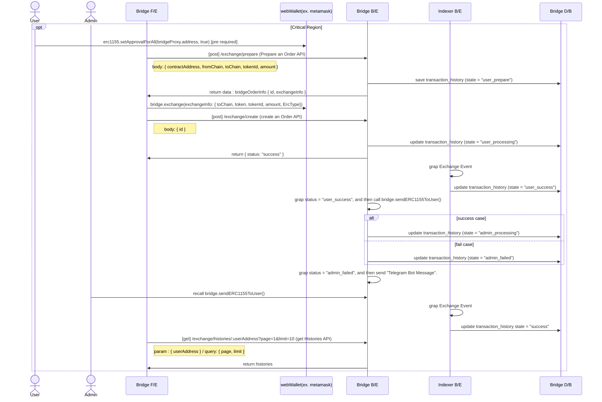

### ERC1155 Exchange

```mermaid
sequenceDiagram
  actor User
  actor Admin
  participant Bridge F/E
  participant webWallet(ex. metamask)
  participant Bridge B/E
  participant Indexer B/E
  participant Bridge D/B

  opt Critical Region
  User ->> webWallet(ex. metamask) : erc1155.setApprovalForAll(bridgeProxy.address, true) [pre required]

  Bridge F/E ->> Bridge B/E : [post] /exchange/prepare (Prepare an Order API)
  Note right of Bridge F/E: body: { contractAddress, fromChain, toChain, tokenId, amount }

  Bridge B/E ->> Bridge D/B : save transaction_history (state = "user_prepare")

  Bridge B/E ->> Bridge F/E : return data : bridgeOrderInfo { id, exchangeInfo }

  Bridge F/E ->> webWallet(ex. metamask) : bridge.exchange(exchangeInfo: { toChain, token, tokenId, amount, ErcType})

  Bridge F/E ->> Bridge B/E : [post] /exchange/create (create an Order API)
  Note right of Bridge F/E: body: { id }

  Bridge B/E ->> Bridge D/B : update transaction_history (state = "user_processing")

  Bridge B/E ->> Bridge F/E : return { status: "success" }

  Indexer B/E ->> Indexer B/E : grap Exchange Event

  Indexer B/E ->> Bridge D/B : update transaction_history (state = "user_success")

  Bridge B/E ->> Bridge B/E : grap status = "user_success", and then call bridge.sendERC1155ToUser()
  alt success case
    Bridge B/E ->> Bridge D/B : update transaction_history (state = "admin_processing")
  else fail case
    Bridge B/E ->> Bridge D/B : update transaction_history (state = "admin_failed")
  end

  Bridge B/E ->> Bridge B/E : grap status = "admin_failed", and then send "Telegram Bot Message".

  Admin ->> Bridge B/E : recall bridge.sendERC1155ToUser()

  Indexer B/E ->> Indexer B/E : grap Exchange Event

  Indexer B/E ->> Bridge D/B : update transaction_history state = "success"

  Bridge F/E ->> Bridge B/E : [get] /exchange/histories/:userAddress?page=1&limit=10 (get Histories API)
  Note right of Bridge F/E: param : { userAddress } / query: { page, limit }

  Bridge B/E ->> Bridge F/E : return histories

end
```
